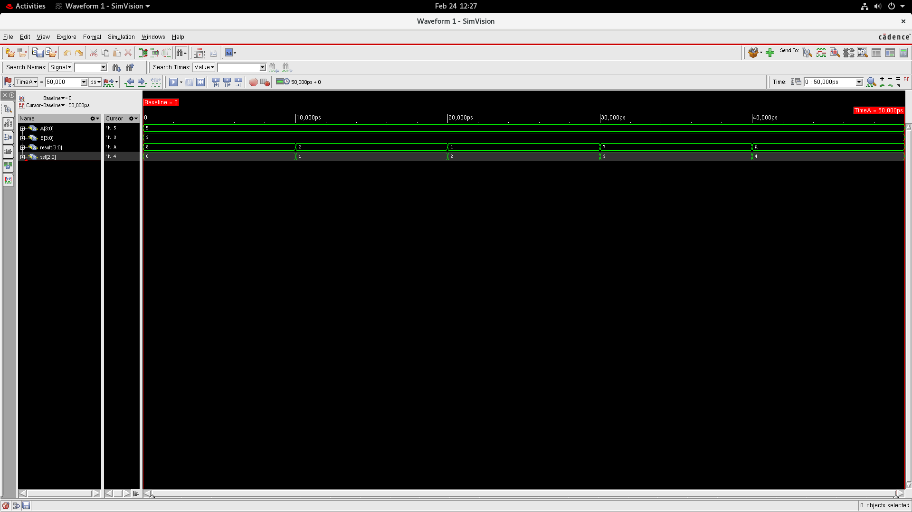
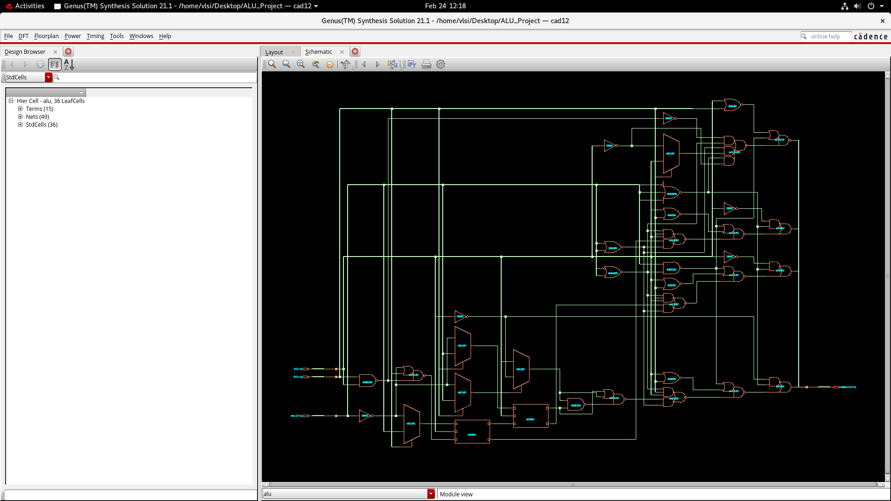

# ARITHMETIC LOGIC UNIT (ALU)

**COMPANY:** CODTECH IT SOLUTIONS

**NAME:** Mallikarjun Goudappanavar

**INTERN ID:** CTIS5769

**DOMAIN:** VLSI  

**DURATION:** 4 Weeks 

**MENTOR:** Neela Santosh  

---

## 📌 Project Overview

This project presents the design and simulation of a 4-bit Arithmetic Logic Unit (ALU) using Verilog Hardware Description Language (HDL). The ALU is an essential component of digital systems responsible for performing arithmetic and logical operations.

The implemented ALU supports five operations: Addition, Subtraction, AND, OR, and NOT. A 3-bit select signal determines the operation performed on the input operands. The design is verified using simulation and synthesized using Cadence Genus to evaluate hardware performance such as power, timing, and area utilization.

---

## 🎯 Objective

- Design a combinational ALU using Verilog HDL  
- Implement arithmetic and logical operations  
- Verify functionality using simulation waveform  
- Perform synthesis and analyze performance metrics  

---

## ⚙️ Tools Used

- Verilog HDL  
- Cadence Genus  
- SimVision  

---

## 💻 Source Code

### 🔹 ALU Design (`alu.v`)
Implements arithmetic and logical operations using two 4-bit inputs and a 3-bit select signal. A case statement performs addition, subtraction, AND, OR, and NOT operations and produces a 4-bit result.

### 🔹 Testbench (`alu_tb.v`)
Applies different input combinations to verify ALU functionality and generates simulation waveforms.

Source files are available in the **Source_Code** folder.

---

## 🧮 ALU Operation Table

| Select | Operation |
|---|---|
| 000 | Addition |
| 001 | Subtraction |
| 010 | AND |
| 011 | OR |
| 100 | NOT |

---

## 🖥 Simulation Output

The waveform verifies correct ALU behavior for different input combinations.

---

## 🔧 RTL Schematic

The RTL view shows the synthesized hardware structure generated from the Verilog design.

---

## 📊 Synthesis Reports

Power, timing, area, and gate-level reports are available in the **Synthesis_Reports** folder.

---

## 📄 Project Report

📥 **Download Full Report:**  
[ALU Simulation Report (PDF)](Project_Report/ALU_Simulation_Report.pdf)

---

## ✅ Results

Simulation confirms correct execution of all operations. Synthesis analysis shows efficient hardware utilization with acceptable power and timing performance.
